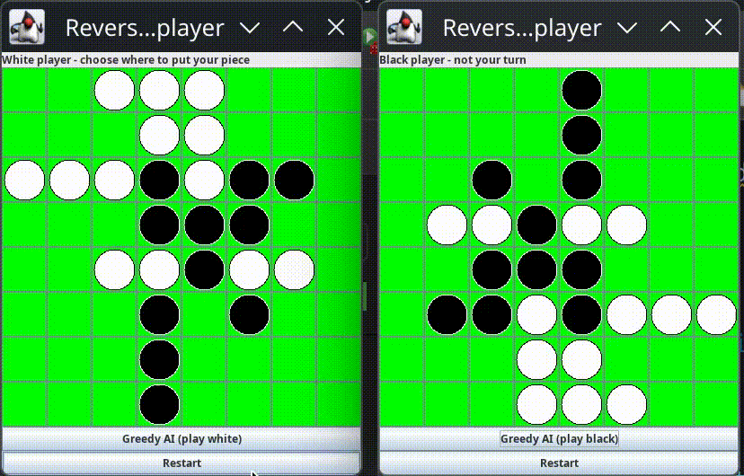

# Reversi in Java

## Overview

* A Java implementation of the board game Reversi for desktops, built using the Swing GUI library, and a Model View Controller (MVC) design. It supports 2 players, or single player against a Greedy AI algorithm.
* The model is implemented in [SimpleModel.java](src/reversi/SimpleModel.java), managing the properties of the board, such as the height, width, current player, board contents and whether the game has ended.
* The view is managed by [GUIView.java](src/reversi/GUIView.java), which visually builds the board using the Swing GUI library, creating the buttons constructed by [BoardSquareButton.java](src/reversi/BoardSquareButton.java).
* The controller is implemented with [ReversiController.java](src/reversi/ReversiController.java), responsible for handling the logic of the game, such as whether a given move is valid in the current state of the game.
* A comprehensive JUnit 5 test suite has also been made to test the key classes in the project.

---

## Key Features

* Language: Java 21
* GUI Library: Swing
* Design Pattern: Model View Controller (MVC)
* Testing: JUnit 5, using a custom test view
* AI: Greedy Opponent evaluates optimal immediate move
